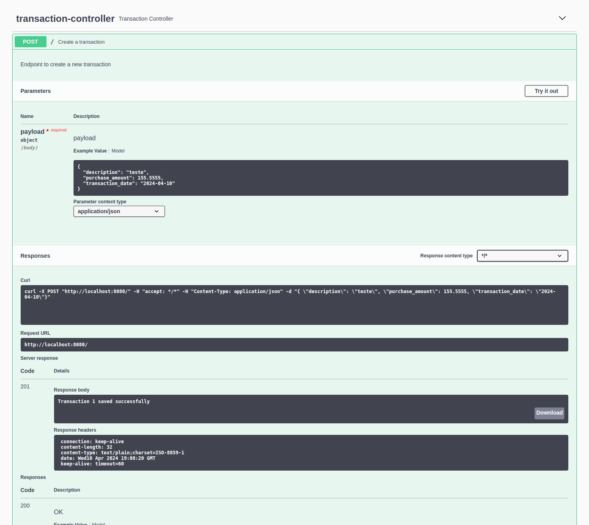

# Purchase Transaction Service

## Overview
This project is a Spring Boot application for managing purchase transactions. It provides APIs for creating new transactions and retrieving transaction details by ID. The application interacts with a PostgreSQL database to store transaction data and fetch exchange rates from an external API.

## Features
- Create new purchase transactions
- Retrieve transaction details by ID
- Conversion of purchase amount to different currencies based on exchange rates
## Technologies Used
- Java
- Spring Boot
- PostgreSQL
- Docker
## How to Run
### Prerequisites
Docker installed on your machine
Docker Compose installed on your machine

### Steps
To run the project, follow these steps:

1. Clone the repository to your local machine.
```bash
git clone https://github.com/zeldsc
```
2. Navigate to the project directory.
```bash
cd purchase-transaction-service
```
3. Start the application using the provided scripts
- Run `chmod +x run.sh` to grant execute permission to the start script.
- Run `./run.sh` to start the application.
4. Stop the application using the provided scripts
- Run `chmod +x stop.sh` to grant execute permission to the stop script.
- Run `./stop.sh` to stop the application.

## API Endpoints
- `POST /api/v1/purchase/transaction`: Create a new transaction.
- `GET /api/v1/purchase/transaction/{id}?currency={currency}`: Get transaction details by ID.

## Additional Notes
- The application uses PostgreSQL as the database. Make sure there are no conflicts with ports if you have PostgreSQL running locally.
- For more information about the API endpoints and usage, refer to the API documentation or the [Swagger UI](http://localhost:8080/swagger-ui/index.html) provided.

## Prints



## Contributors
- [Felipe Caldas](https://github.com/zeldsc)
